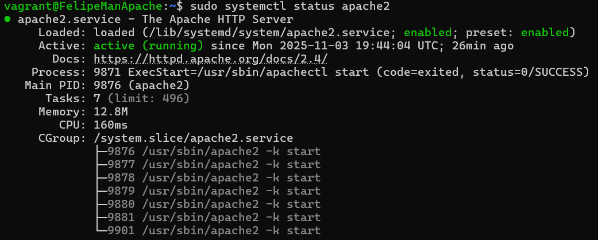
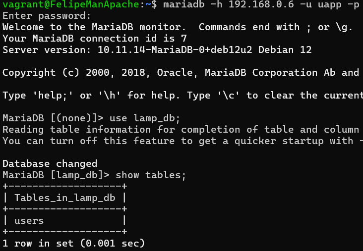
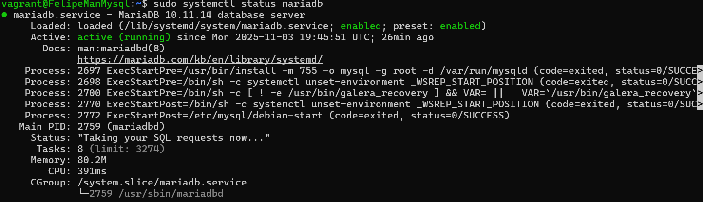
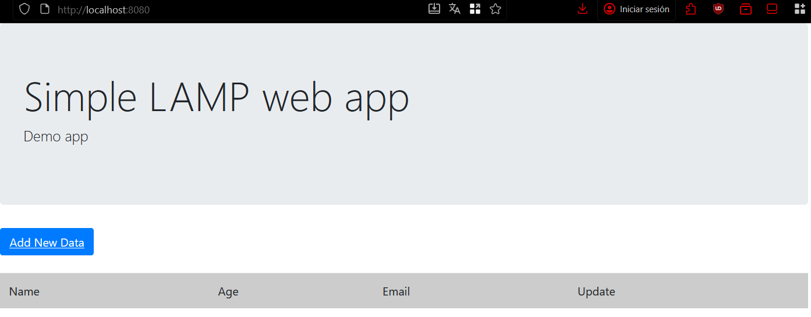

# iaw-lamp-dosniveles
Práctica LAMP en dos niveles en Vagrant

## Autor
David Felipe Manosalva Niño

## Objetivo

El objetivo de esta práctica es montar una infraestructura **LAMP (Linux, Apache, MySQL/MariaDB, PHP)** en **dos niveles** utilizando **Vagrant**. La aplicación que se despliega es un sistema de gestión de usuarios descargable desde [este enlace](https://informatica.iesalbarregas.com/mod/url/view.php?id=4382).

Se busca que, tras ejecutar `vagrant up`, la infraestructura esté lista, la aplicación esté desplegada correctamente y sea accesible desde un navegador.

---

## Estructura del Proyecto

El proyecto contiene los siguientes archivos:

- `Vagrantfile`: define las máquinas virtuales, sus IPs, hostnames y aprovisionamiento.  
- `aprov_apache.sh`: script para configurar el servidor Apache y PHP, instalar dependencias y desplegar la aplicación.  
- `aprov_mysql.sh`: script para configurar MariaDB, crear la base de datos y el usuario, y definir permisos.  
- `README.md`: este documento explica la práctica, los scripts y cómo verificar el entorno.  

---

## Aprovisionamiento de Apache (`aprov_apache.sh`)

```bash
#!/bin/bash
set -e  #Permite que el script se detenga si cualquier comando falla

#Se actualizan los paquetes disponibles
sudo apt update -y

#Se instala Apache, PHP, las librerías necesarias para MariaDB, Git y el cliente de MariaDB
sudo apt install -y apache2 php libapache2-mod-php php-mysql git mariadb-client

#Se clona la aplicación desde GitHub a una carpeta temporal
cd /tmp
git clone https://github.com/josejuansanchez/iaw-practica-lamp.git

#se limpia el directorio web actual y copiamos los archivos de la aplicación
sudo rm -r /var/www/html/*
sudo cp -rf iaw-practica-lamp/src/* /var/www/html/

#Se configura los permisos y el propietario de los archivos para que Apache pueda acceder correctamente
sudo chown -R www-data:www-data /var/www/html
sudo chmod -R 755 /var/www/html

#Configuramos la conexión a la base de datos en config.php, cambiando los datos por defecto por los correspondientes a la base de datos
sudo sed -i "s/define('DB_HOST'.*/define('DB_HOST', '192.168.0.6');/" /var/www/html/config.php
sudo sed -i "s/define('DB_NAME'.*/define('DB_NAME', 'lamp_db');/" /var/www/html/config.php
sudo sed -i "s/define('DB_USER'.*/define('DB_USER', 'uapp');/" /var/www/html/config.php
sudo sed -i "s/define('DB_PASSWORD'.*/define('DB_PASSWORD', 'papp');/" /var/www/html/config.php

#Se reinicia Apache para que los cambios se lleven a cabo
sudo systemctl restart apache2

```

## Aprovisionamiento de Mysql (`aprov_mysql.sh`)
```bash
#!/bin/bash
set -e  #detiene el script si hay algún error

#se definen variables que se tendran en cuenta mas adelante
DB_ROOT_PASS="toor"
DB_NAME="lamp_db"
DB_USER="uapp"
DB_PASS="papp"

#Actualizamos los repositorios
sudo apt update -y

#Se instala MariaDB Server
sudo apt install -y mariadb-server

#Configuramos MariaDB para aceptar conexiones externas cambiando el bind-address (desde Apache). Fue uno de los errores que me salieron
sudo sed -i "s/^bind-address.*/bind-address = 0.0.0.0/" /etc/mysql/mariadb.conf.d/50-server.cnf

#Se habilita y se arranca MariaDB
systemctl enable mariadb
systemctl start mariadb

# Creamos la base de datos, el usuario con permisos adecuados y la tabla users que se tomo en cuenta del github de la actividad
mysql -u root <<CONF
alter user 'root'@'localhost' identified by '${DB_ROOT_PASS}';
create database if not exists ${DB_NAME};
create user if not exists '${DB_USER}'@'192.168.0.5' identified by '${DB_PASS}';
grant all privileges on ${DB_NAME}.* to '${DB_USER}'@'192.168.0.5';
flush privileges; 

# Creamos la tabla 'users' si no existe
use ${DB_NAME};
CREATE TABLE users (
  id INT UNSIGNED AUTO_INCREMENT PRIMARY KEY,
  name VARCHAR(100) NOT NULL,
  age INT UNSIGNED NOT NULL,
  email VARCHAR(100) UNIQUE NOT NULL
) ENGINE=InnoDB DEFAULT CHARSET=utf8;
CONF

# Bloqueamos la salida a Internet para la máquina de MariaDB
ip route del default

# Reinicio final para asegurar que todo se aplica
sudo systemctl restart mariadb

```
## Comprobación del estado de los servicios

### Apache
#### Estado:


#### Conexion desde Apache a MariaDB:


### MariaDB
#### Estado:


### Acceso a la aplicacion:


### Screencast de la aplicación
Puedes ver el funcionamiento de la aplicación en este [video en YouTube](https://youtu.be/6ee68w6q2vY).
